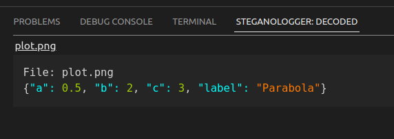

# steganologger
A VSCode extension to extract data logged in plots using the steganologger python script.

## Usage
### Decoding
Right click an image (only png files are accepted) in the explorer window. At the bottom of the context menu, the option "Decode image" will appear. If this option is chosen, the decoded text (if any) will be shown as a JSON document in the `Steganologger` view in the VSCode panel.

### Encoding
This uses the python script . Download the script and put it somewhere in your python path. You can then include the script and use the `encode` function:

```python
from steganologger import encode
from matplotlib import pyplot as plt
import numpy as np

#create a config
config = {"a": 0.5, "b": 2, "c": 3, "label": "Parabola"}

#create some plot using the config
x = np.linspace(-10,10,100)
y = config["a"]*x**2+config["b"]*x+config["c"]
plt.figure(figsize=(5,4))
plt.plot(x,y,label=config["label"])
plt.xlabel("$x$")
plt.ylabel("$y$")
plt.legend()
plt.savefig("plot.png", dpi=250)

#save the config
encode("plot.png", data=config, overwrite=True)
```

### Using the python script from the commandline
You can also call the python file mentioned above from the commandline. For example, to see data saved in the image above, use
```bash
$ python3 steganologger.py --decode --file=plot.png
{"a": 0.5, "b": 2, "c": 3, "label": "Parabola"}
```

## In VSCode
The extension adds a new tab to the panel. After decoding the image created in the example above by right-clicking on the image in the file explorer and delecting `Decode image`:
 

## Bugs/issues
- A whole lot. This extension is very much in its testing phase. If you find a bug or have a feature request, let me know: 
